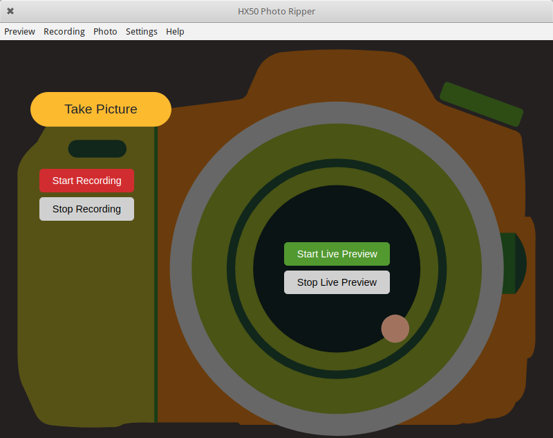

## HX50 Photo Ripper - Control Your Camera



### Add And Install From PPA

PPA is located [here](https://launchpad.net/~hda-me/)

You can add and install any available module with:

```bash
sudo apt-add-repository ppa:hda-me/
sudo apt-get update
sudo apt-get install 
```

Package names:

### Cross-platform Releases

1. GNU/Linux - [64 bit]() [32bit]()
2. Windows 7 and later - [64 bit]() [32bit]()
3. Windows XP and older(?) - [32bit]() [64 bit]()
4. macOS - [64 bit]()

### Preferences

You can set most preferences using Settings Menu in HX50 Photo Ripper. But you need to preset envs for [hydra](https://github.com/gnd/hydra). Hydra used for Live Preview Window and works only in Linux.

Export liveview path for ex.: `export CAM_LV="http://10.0.0.1:60152"`

Export save folder path for ex.: `export SAVE_LV="/mnt/LV/sony_%05d.jpeg"`

### How It Works

It works using [Camera Remote API](https://developer.sony.com/develop/cameras/)

You can check [light version](https://github.com/cryptofuture/hx50ripper/tree/master/light) for easier understanding or for request testing

* actions.actTakePicture - Takes Picture
* actions.startLive - Starts LiveView
* actions.stopLive - Stops LiveView
* actions.startMovieRec - Starts Record
* actions.stopMovieRec - Stops Record
* setShootMode - Switches Shoot Mode

Live Preview Window works using [hydra](https://github.com/gnd/hydra) and I ship [forked version](https://github.com/cryptofuture/hydra), since it uses ENVs instead of hardcoded values. Also hydra works only in Linux

### Building Cross-platform Releases

Use `npm run prod` or `npm run prod-xp` for Windows XP binaries

### Donation

Consider making a donation, if you like what I doing.

I working remotely and income is unstable, so every little bit helps.

Also it would be nice if you provide, a note on `admin@hda.me` after making a donation with information what you like and what you want to improve. So, I would consider giving more time and support to particular project.

I also open to reasonable work offers, especially if offer would be close to a field or project I work with.

#### E-money & Fiat

##### Yandex Money
[](https://money.yandex.ru/to/410015241627045)
##### Advanced Cash
[Open](https://wallet.advcash.com/pages/transfer/wallet) and use `mmail@sent.com` in `Specify the recipient's wallet or e-mail` field
##### PayPal
[](https://paypal.me/hdadonation)
##### Payeer
[](https://payeer.com/en/account/send/) use `P2865115` in `Account, e-mail or phone number` field

#### Cryptocurrency

##### Bitcoin
Address is `1N5czHaoSLukFSTq2ZJujaWGjkmBxv2dT9`
##### Musicoin 
Address is `0xf449f8c17a056e9bfbefe39637c38806246cb2c9`
##### Ethereum
Address is `0x23459a89eAc054bdAC1c13eB5cCb39F42574C26a`
##### Other 
I could provide you with some relatively cheap "hardware" donation options directly to my PO Box, if you prefer real gifts. Ask for details on `admin@hda.me`
